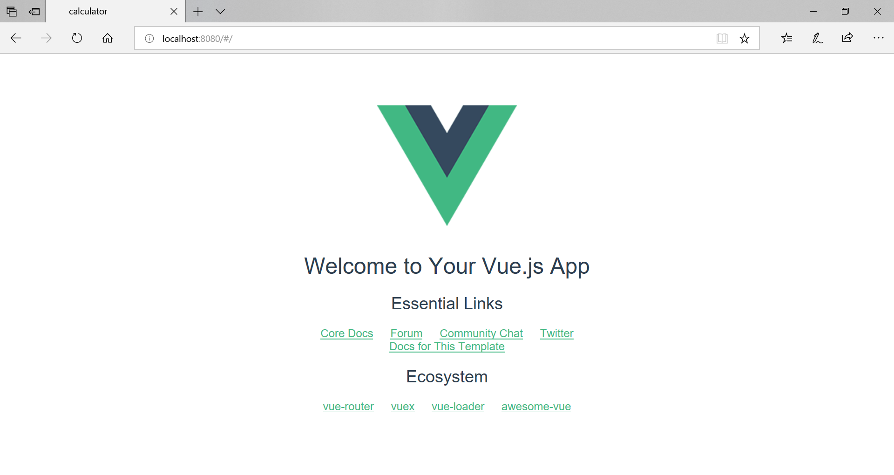
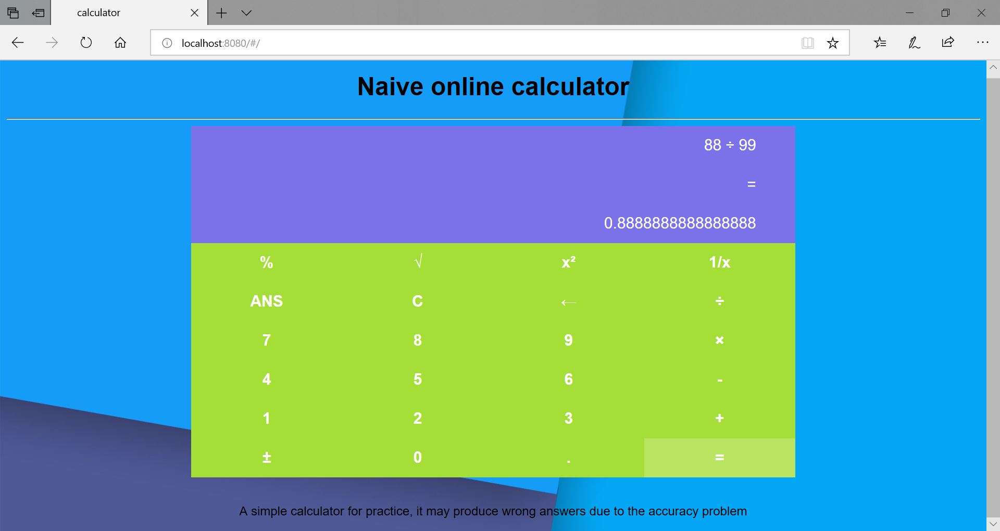
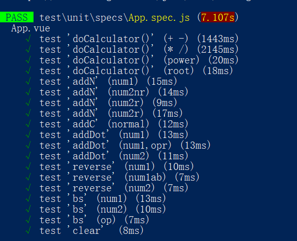
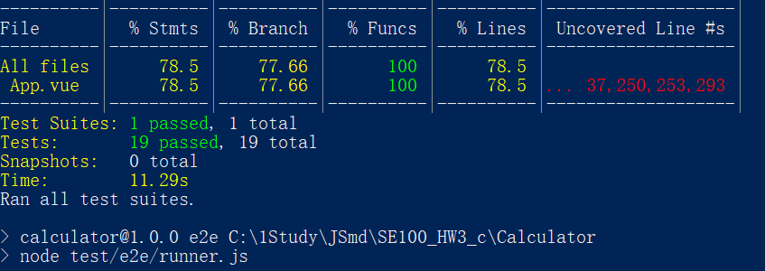

# SE100_HW3

a repo of an application's front-end. Using npm and Vue.js

## Progress of a simple application's front-end

### Installation of Vue

Install vue using cnpm:

```powershell
PS C:\1Study\JSmd\SE100_HW3> npm install cnpm -g

PS C:\1Study\JSmd\SE100_HW3> cnpm install vue
```

Install vue-cli, which provided by official to build applications:

```powershell
PS C:\1Study\JSmd\SE100_HW3> cnpm install --global vue-cli
```

### Create a project based on webpack

```powershell
PS C:\1Study\JSmd\SE100_HW3> vue init webpack my-project

? Project name calculator
? Project description a simple application for se100-hw3
? Author sebastianj1w <sebastianj1w@outlook.com>
? Vue build standalone
? Install vue-router? Yes
? Use ESLint to lint your code? Yes
? Pick an ESLint preset Standard
? Set up unit tests Yes
? Pick a test runner jest
? Setup e2e tests with Nightwatch? Yes
? Should we run `npm install` for you after the project has been created? (recommended) npm
```

### Run the application's demo

```powershell
PS C:\1Study\JSmd\SE100_HW3> cd .\my-project\

PS C:\1Study\JSmd\SE100_HW3\my-project> npm run dev
```

```powershell
 DONE  Compiled successfully in 5954ms                                                                                                                             17:13:28

 I  Your application is running here: http://localhost:8080
```

Then I can see the demo:
<div  align="center">

</div>

### Modify the files

Modify the App.vue and index.html to create your own application.
I place static files in the /Calculator/static folder

### Run it

```powershell
PS C:\1Study\JSmd\SE100_HW3\my-project> npm run dev
```

It works:
<div  align="center">

</div>

### Unit Test

Using Jest to do unit test

Testing functions passed:
<div  align="center">

</div>
Coverage:
<div  align="center">

</div>

Files are in /Calculator/test folder